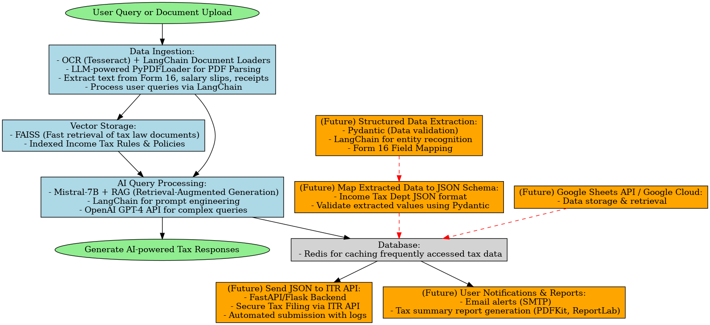

# TaxBuddy : AI-Powered Tax Assistant

**Automated Document Processing & Tax Advisory with LLMs**

[](https://www.python.org/)
[](https://github.com/hwchase17/langchain)
[](https://pypi.org/project/PyPDF2/)
[](https://github.com/facebookresearch/faiss)

---

## Overview

TaxBuddy addresses the complexity and uncertainty of tax filing by providing an AI-driven platform that:
- Automatically extracts critical data from financial documents (e.g., Form 16, salary slips, receipts).
- Answers tax-related queries using state-of-the-art language models.
- Integrates with official tax websites for up-to-date regulatory information.
- Plans to evolve into a fully automated tax filing solution with secure cloud storage and advanced analytics.

---


---
This project leverages **LangChain**, **FAISS**, and **LLMs** like **OpenAI GPT-4** (with a future option to integrate models such as Mistral-7B or custom RAG pipelines). It aims to streamline the entire tax workflow—from OCR-based document ingestion to structured JSON data output and integrated reports.

---
## Features

### Current Implementation
- *Document Parsing & Data Ingestion:*  
  - Utilizes [LangChain Document Loaders](https://github.com/langchain-ai/langchain) and an LLM-powered PyPDFLoader to parse PDFs and extract text from Form 16, salary slips, and receipts.
  - Segments text using the RecursiveCharacterTextSplitter for efficient processing.
- *Vector Storage & Query Processing:*  
  - Employs *FAISS* for fast vector storage and retrieval of indexed tax law documents.
  - Leverages Mistral-7B combined with Retrieval-Augmented Generation (RAG) and GPT-4 for answering complex tax queries.
- *User Interface:*  
  - A responsive, Streamlit-based chatbot interface that allows users to interact with TaxBuddy in real time.

### Future Enhancements
- *Structured Data Extraction:*  
  - Integrate *Pydantic* with LangChain to extract and validate key fields (e.g., income, deductions) from documents.
- *Automated Tax Filing:*  
  - Map extracted data to the Income Tax Department’s JSON schema and integrate with ITR APIs for automated tax submission.
- *Cloud-Based Storage & Analytics:*  
  - Transition data storage to *Google Sheets API/Google Cloud* for enhanced scalability, secure storage, and streamlined retrieval.
- *Enhanced Conversational AI:*  
  - Improve the chatbot with advanced conversational models and multilingual support.
- *Fraud Detection & Reporting:*  
  - Incorporate ML-based anomaly detection to prevent tax fraud and generate detailed tax summary reports.

---


## Tech Stack

| Component                       | Technology                                                                                                            |
|--------------------------------|-----------------------------------------------------------------------------------------------------------------------|
| **Language**                    |               |
| **PDF & OCR**                   |                                                      |
| **Vector Database**             |                                      |
| **LLM Framework**               |                                                |
| **LLM Provider**                |               |
| **Data Validation** (Future)    | ![Pydantic]                                                                                                      |


---

## Installation

Follow the steps below:

1. Create `.env` file.

2. Configure Huggingface
   - Visit the [huggingface website](https://huggingface.co/) and login/sign-up.
   - Get your API Key
   - Update `HF_TOKEN` in `.env` with your actual key


4. **Setup Project**:
```bash
# Clone repository
git https://github.com/KavyaMitruka/Tax-Assistant.git
cd Tax-Assistant

# Install dependencies
pipenv install -r requirements.txt

#Create memory with LLM
pipenv run python llm_memory.py

#Connect memory with LLM
pipenv run python connect_memory.py

# Launch application
streamlit run frontend.py
```

---
## Contributing

1. **Fork the Project**
2. **Create your Feature Branch**
   ```bash
   git checkout -b feature/AmazingFeature
   ```
3. **Commit your Changes**
   ```bash
   git commit -m 'Add some AmazingFeature'
   ```
4. **Push to the Branch**
   ```bash
   git push origin feature/AmazingFeature
   ```
5. **Open a Pull Request**

TaxBuddy is a revolutionary step toward simplifying tax filing and planning through intelligent automation. Enjoy the journey, and happy filing!

